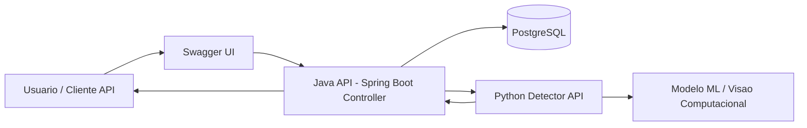

# Arquitetura - Deteccao de Falhas em Parafusos

## Fluxo principal

1. O usuario envia a requisicao pelo Swagger UI.
2. O Controller Java recebe os dados da analise do parafuso.
3. A API Java consulta ou registra informacoes no PostgreSQL.
4. A API Java envia a imagem ou os metadados para o servico Python.
5. O servico Python executa a deteccao de falhas usando o modelo de ML.
6. A API Java recebe o resultado e retorna a resposta ao usuario.

## Servicos no Docker Compose

- `java-api`: API principal em Java/Spring Boot, exposta em `http://localhost:8080`.
- `python-detector`: servico Python para inferencia, exposto em `http://localhost:8000`.
- `postgres`: banco de dados da aplicacao, exposto em `localhost:5432`.
- `pgadmin`: ferramenta opcional de administracao do banco, exposta em `http://localhost:5050` usando o profile `tools`.
